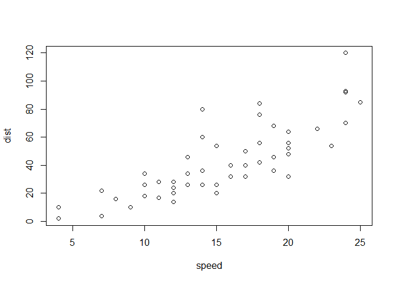

# README
Fan Li  
Sunday, August 24, 2014  

Course: Practical Machine Learning

#### Background

With the increasing popularity of wearable devices for health/exercies monitoring, there is a demand to improve our analytical capability of the data generated by the devices. Particularly it is desirable to know not only how much of a particular activity people do, but also quantify how well they do it. The objective of this project is to develop a statistical model to predict how effective people perform barbell lift exercise based on data from accelerometers on their body.


```r
library(knitr)
library(ggplot2)
library(reshape2)
library(dplyr)
```

```
## 
## Attaching package: 'dplyr'
## 
## The following objects are masked from 'package:stats':
## 
##     filter, lag
## 
## The following objects are masked from 'package:base':
## 
##     intersect, setdiff, setequal, union
```

```r
library(caret)
```

```
## Loading required package: lattice
```

```r
library(randomForest)
```

```
## randomForest 4.6-10
## Type rfNews() to see new features/changes/bug fixes.
```

```r
setwd("C:/Users/Fan/R/Kaggle/Forest Cover Type Prediction")
options(stringsAsFactors=FALSE)
```

You can also embed plots, for example:

 

Note that the `echo = FALSE` parameter was added to the code chunk to prevent printing of the R code that generated the plot.
