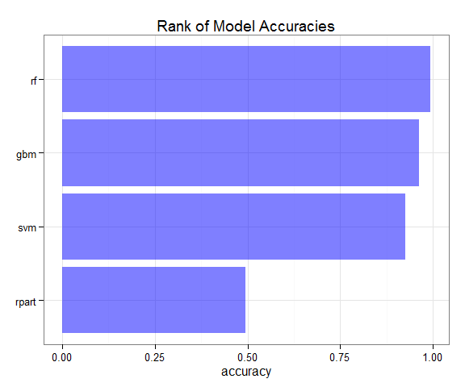

# Course Project for Practical Machine Learning
Saturday, September 20, 2014  

#### Introduction

With the increasing popularity of wearable devices for health/exercies monitoring, there is a demand to improve our analytical capability of the data generated by the devices. The objective of this project is to develop a statistical model to predict how effective people perform barbell lift exercise based on data from accelerometers on their body.


```r
library(knitr)
library(ggplot2)
library(dplyr)
library(caret)
library(randomForest)

options(stringsAsFactors=FALSE)
```


#### Data Preprocessing

**Remove unrelated variables** There are 159 variables in the original datasets. The first 6 variables (user_name, raw_timestamp_part_1, raw_timestamp_part_2, cvtd_timestamp, new_window, num_window) are record metadata and not predictors. Therefore they are removed from the dataset.


```r
pml_training <- read.csv("pml-training.csv", row.names=1)
pml_testing <- read.csv("pml-testing.csv", row.names=1)
#str(pml_training)
pml_training <- pml_training[, -(1:6)]
pml_testing <- pml_testing[, -(1:6)]
```

**Remove predictors with NA's** In the training data, there are 67 predictors contain 97.9% NA's or blank(""). In the testing data, there are 100 predictors contain all NA's or blank (including the 67 variables in the training set). They are therefore removed before the modeling process.

```r
# Calculate NA distribution
#table(colSums(is.na(pml_training))/nrow(pml_training))  # 67 columns 97.9% NA
#table(colSums(is.na(pml_testing))/nrow(pml_testing))  # 100 columns 100% NA

# Remove Na columns
has.na <- colSums(is.na(pml_testing)) > 0
pml_training <- pml_training[, !has.na]
pml_testing <- pml_testing[, !has.na]
```


#### Model Selection

Herein, we compared four models (rpart, svm, gbm and rf) and chose the best one based on the accuracy on the validation set.


```r
in.train <- createDataPartition(pml_training$classe, p=0.60, list=FALSE)
train <- pml_training[in.train, ]  # Training set
test <- pml_training[-in.train, ]  # Validation set
```

**rpart Model** 10-fold cross validation was used in training a rpart model. Default values were used for all other parameters. The accuracy on the validation set is 0.4936. The confusion matrix is shown below.


```r
if(file.exists("models/model_rpart.Rdata")){
  load("models/model_rpart.Rdata")
}else{
  model.rpart <- train(as.factor(classe)~., data=train, method="rpart", trControl=trainControl(method = "cv", number = 10))
}
confusionMatrix(predict(model.rpart, test), test$classe)$table
```

```
## Loading required package: rpart
```

```
##           Reference
## Prediction    A    B    C    D    E
##          A 2023  652  652  606  196
##          B   34  509   43  219  175
##          C  168  357  673  461  400
##          D    0    0    0    0    0
##          E    7    0    0    0  671
```


**Support Vector Machine** 10-fold cross validation was used in training a rpart model. Default values were used for all other parameters. The accuracy on the validation set is 0.9266. The confusion matrix is shown below.


```r
if(file.exists("models/model_svm.Rdata")){
  load("models/model_svm.Rdata")
}else{
  model.svm <- train(as.factor(classe)~., data=train, method="svmRadial", trControl=trainControl(method = "cv", number = 10))
}
confusionMatrix(predict(model.svm, test), test$classe)$table
```

```
## Loading required package: kernlab
```

```
##           Reference
## Prediction    A    B    C    D    E
##          A 2208  132    6    2    2
##          B    5 1338   64    4    6
##          C   16   48 1270  137   56
##          D    0    0   26 1142   48
##          E    3    0    2    1 1330
```


**Generalized Boosted Model** 10-fold cross validation was used in training a rpart model. Default values were used for all other parameters. The accuracy on the validation set is 0.9638. The confusion matrix is shown below.


```r
if(file.exists("models/model_gbm.Rdata")){
  load("models/model_gbm.Rdata")
}else{
  model.gbm <- train(as.factor(classe)~., data=train, method="gbm", trControl=trainControl(method = "cv", number = 10))
}
confusionMatrix(predict(model.gbm, test), test$classe)$table
```

```
##           Reference
## Prediction    A    B    C    D    E
##          A 2204   34    0    1    4
##          B   15 1450   39    7    5
##          C   10   30 1316   27   13
##          D    2    3   12 1243   19
##          E    1    1    1    8 1401
```


**Random Forest Model** No cross-validation set-up is needed as bootstrap is used internally. The accuracy on the validation set is 0.9943. The confusion matrix is shown below.


```r
if(file.exists("models/model_rf.Rdata")){
  load("models/model_rf.RData")
}else{
  model.rf <- train(as.factor(classe)~., data=train, method="rf")
}

confusionMatrix(predict(model.rf, test), test$classe)$table
```

```
##           Reference
## Prediction    A    B    C    D    E
##          A 2231    3    0    0    0
##          B    0 1515    4    0    0
##          C    0    0 1363   11    0
##          D    0    0    1 1275    0
##          E    1    0    0    0 1442
```

```r
#varImp(model.rf)
```

In comparison, the Random Forest model delivered the highest accuracy on the validation set. Based on this model, the five most important variables are: roll_belt, yaw_belt, magnet_dumbbell_z, magnet_dumbbell_y and pitch_belt.


```r
accuracy <- data.frame(model=c("rpart", "svm", "gbm", "rf"),
                       accuracy=c(0.4936, 0.9266, 0.9638, 0.9943))
ggplot(accuracy, aes(x=reorder(model, accuracy), y=accuracy)) +
  geom_bar(stat="identity", fill="blue", alpha=0.5) +
  coord_flip() +
  theme_bw() +
  theme(axis.title.y = element_blank()) +
  ggtitle("Rank of Model Accuracies")
```

 


#### Test Set Result

Finally, the Random Forest model was applied to the test dataset. The answers are all correct according to the auto-grader.


```r
answers <- as.character(predict(model.rf, pml_testing))

pml_write_files = function(x){
  n = length(x)
  for(i in 1:n){
    filename = paste0("answers/problem_id_",i,".txt")
    write.table(x[i],file=filename,quote=FALSE,row.names=FALSE,col.names=FALSE)
  }
}
pml_write_files(answers)
```


